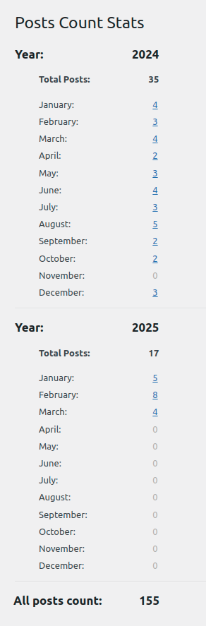
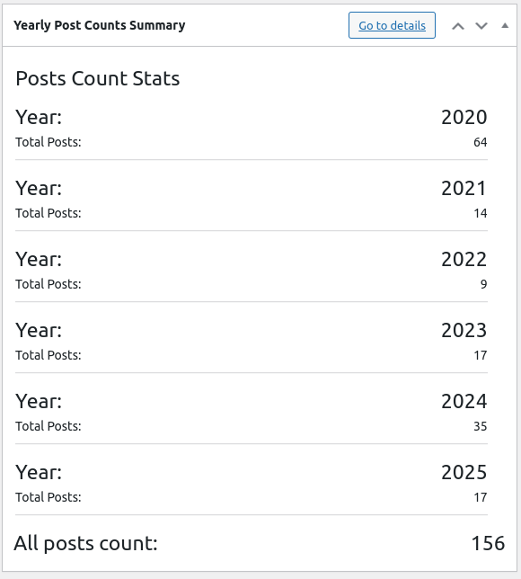

# posts-counts-stats WordPress plugin

## Intro
WordPress plugin for display yearly/monthly posts counts statistics inside WP' admin panel.

Display yearly and monthly posts counts in WordPress admin settings in a hierarchical format.

There are links on count number with redirect to posts list and filter for particular year and month, so you can review posts from selected year and month.

There is additional dashboard widget for WP admin cocpit main page (with only yearly summaries of posts counts). You can go to details page (with monthly posts counts stats) from widget (link exists).

You can see yearly stats on simple bar graph, too.

## How to install inside Wordpress

Compatibility with WP versions from `6.1.x` to `6.7.x` (not tested with WP dev/trunk branch!).

### With server SSH access (manual create folder and file inside plugins dir)

1. Create a new folder in your `wp-content/plugins` directory, e.g., posts-counts-stats.

2. Save the code above in a file called `posts-counts-stats.php` (copy/pasted from this repository) within the folder.

### Without SSH access (using ZIP file)

1. Go to this page (https://github.com/bieli/posts-counts-stats--wp-plugin/releases) and download latest ZIP file `posts-conunts-stats.zip` from `Assets`.

2. Upload plugin inside WP admin panel Plugins -> Upload from ZIP

...

3. Go to the WordPress admin panel and activate the plugin in the `Plugins` section.

4. Navigate to `Settings > Posts Counts Stats` in the WordPress admin menu to view the stats.

## How it works (view with random data about posts)

## Development basic steps (depends on your env.)

1. Run `composer install` to install dependencies.

2. You need to add/modify unit test files under tests/ (e.g., tests/Unit/PostsCountsStatsTest.php).

2. Execute tests with `composer test` or `vendor/bin/phpunit`.
